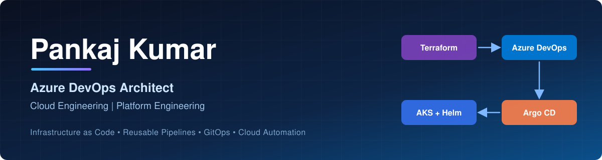

  

I build and automate cloud infrastructure and application delivery using Microsoft Azure, Terraform, Azure DevOps, Docker, Kubernetes, and GitOps practices.

My focus is reusable infrastructure modules, standardized CI/CD pipelines, secure deployments, and maintainable engineering platforms.

## Technical Skills

- **Cloud:** Microsoft Azure, Azure Kubernetes Service (AKS)
- **IaC:** Terraform, reusable modules, `for_each`, per-environment tfvars
- **CI/CD:** Azure DevOps YAML, step/job/stage templates, parameterized thin pipelines
- **Containers & GitOps:** Docker, Kubernetes, Helm, Argo CD
- **Automation:** Bash, Python

## Featured Projects

| Project | What it shows | Status |
|---|---|---|
| [terraform-azure-platform](https://github.com/pankajdsgithub/terraform-azure-platform) | Modular Terraform, `for_each`, multi-environment tfvars | 🟡 In progress |
| [azure-devops-infra-pipelines](https://github.com/pankajdsgithub/azure-devops-infra-pipelines) | Reusable stage/job/step templates, thin consumer pipeline | 🟡 In progress |
| azure-devops-app-pipelines | Template-driven app CI/CD for multiple teams | ⚪ Planned |
| kubernetes-helm-platform | Reusable Helm charts, per-env values | ⚪ Planned |
| argocd-gitops-platform | Argo CD apps, sync policies, drift reconciliation | ⚪ Planned |

> Status is updated as each project is published and validated.

## Earlier Work (Data Science, 2021)
[Machine-Learning](https://github.com/pankajdsgithub/Machine-Learning) · [datamining](https://github.com/pankajdsgithub/datamining)

## Connect
[LinkedIn](https://www.linkedin.com/in/YOUR-LINKEDIN-ID) · [GitHub](https://github.com/pankajdsgithub)
